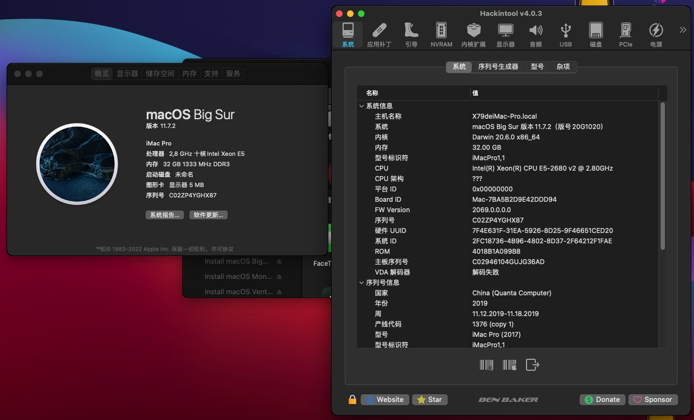

# YINGJIE-X79-PRO-V2.4-Hackintosh
应用于鹰捷 X79 PRO V2.4的OpenCore 1.0.3的黑苹果引导 支持macOS Big Sur

注意：
- 此EFI不含三码 实际使用时请自行使用[OCAT](https://github.com/ic005k/OCAuxiliaryTools)生成
- 此EFI仅在旧版本主板V2.4版(没有USB 3.0前置插针)上测试通过，新版的V3.0版本未测试。


### 配置清单
|类型|型号|规格|
|---|---|---|
|CPU|Intel Xeon E5-2680 V2|2.80 GHz|
|内存|三星 32GB DDR3 REG ECC|1333 MHz|
|SSD|威刚 SP580 SATA SSD|256 GB|
|硬盘|希捷 7200 RPM|500 GB|
|显卡|NVIDIA GT1030(GP108)|2 GB|
|网卡|RealTek 8168|1000 Mbps|
|声卡|RealTek ALC662|立体声|
|操作系统|macOS Big Sur|11.7|
|BIOS|AMI UEFI X79SMA08|UEFI 2.3.1; PI 1.2|

#### 附注事项
- 以上配置清单给出的显卡仅为本人临时测试使用，实际使用时请更换其它可被Big Sur免驱的独显，**不要使用OCLP补丁，否则卡码**。
- CSM不需要完全关闭，也可以正常引导系统且不卡码。
- 睡眠未测试，如果出现睡死问题，可使用终端强制关闭睡眠功能：
```
sudo pmset -a sleep 0
sudo pmset -a hibernatemode 0
sudo pmset -a disablesleep 1
```
